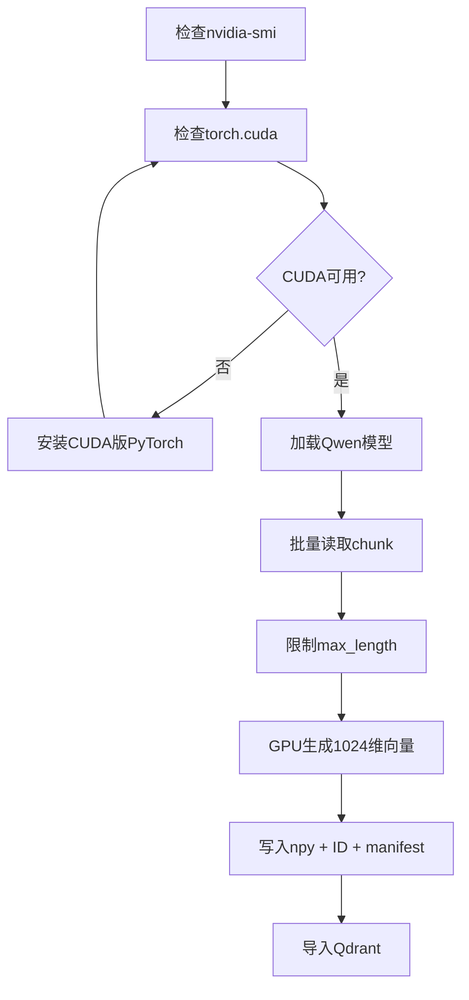

# 04 本地 CUDA Embedding

本篇说明如何使用本机 NVIDIA GPU 运行 `Qwen3-Embedding-0.6B`。

## GPU 工作流



## 1. 检查显卡和 PyTorch

```powershell
nvidia-smi
python -c "import torch; print('torch=',torch.__version__); print('cuda=',torch.cuda.is_available()); print('device=',torch.cuda.get_device_name(0) if torch.cuda.is_available() else 'none')"
```

必须看到 `cuda=True`、带 CUDA 标记的 PyTorch 版本，以及正确的 NVIDIA GPU 名称。

如果当前是 CPU 版 PyTorch，可安装 CUDA 版：

```powershell
python -m pip install --force-reinstall torch==2.12.1+cu130 `
  --index-url https://download.pytorch.org/whl/cu130 `
  --no-cache-dir
```

## 2. 配置模型

在 `config/embedding.yaml` 设置：

```yaml
provider: qwen
model: Qwen/Qwen3-Embedding-0.6B
device: cuda
batch_size: 16
max_length: 2048
normalize: true
```

`max_length` 很重要。UE C++ 类型可能非常大，必须限制输入 token 数，避免单条文本占满显存。

## 3. 单条冒烟测试

```powershell
python -c "from ue_rag.embedding import QwenEmbeddingProvider,load_embedding_config; p=QwenEmbeddingProvider(load_embedding_config()); v=p.embed_query('UE character movement network prediction'); print('device=',p.device,'shape=',v.shape,'norm=',float((v*v).sum())**0.5); p.close()"
```

正常结果应显示 `device=cuda`、`shape=(1024,)`，且 norm 接近 1。

## 4. 小批量测试

```powershell
python scripts/embed.py `
  --input work/t08_character_movement.jsonl `
  --output work/t22_smoke.npy `
  --batch-size 8 `
  --max-length 1024 `
  --progress-every 100
```

先用小文件验证显存和输出，再开始全量任务。

## 5. 全量生成

```powershell
python scripts/embed.py `
  --input data/chunks/engine/chunks.jsonl `
  --output data/embeddings/engine/embeddings.npy `
  --batch-size 16 `
  --max-length 2048 `
  --progress-every 10000
```

输出：

```text
data/embeddings/engine/embeddings.npy
data/embeddings/engine/embeddings.npy.ids.jsonl
data/embeddings/engine/embeddings.npy.manifest.json
```

## 6. 查看进度

```powershell
Get-Content "work/t22_embedding.stdout.log" -Tail 20 -Wait
nvidia-smi
```

也可以查看缓存数量：

```powershell
python -c "import sqlite3; c=sqlite3.connect('data/embeddings/cache.sqlite3'); print(c.execute('select count(*) from embeddings').fetchone()[0]); c.close()"
```

缓存数量只能作为近似值，因为相同文本可能共享缓存。
