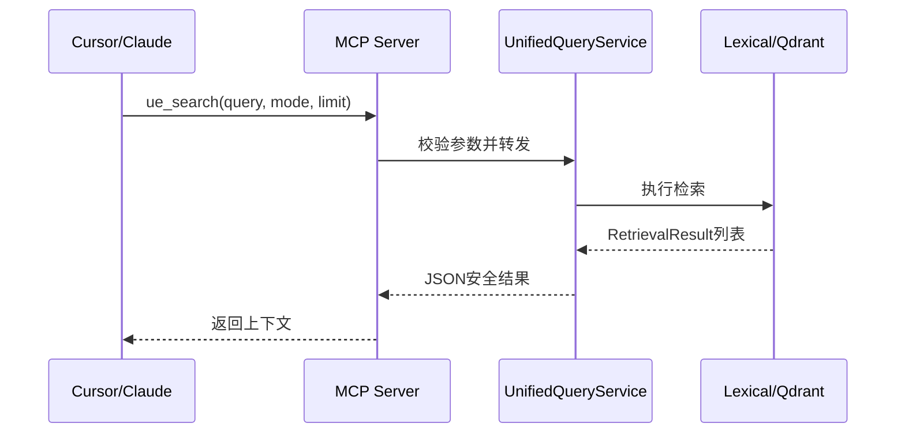

# 05 MCP、项目和 Blueprint

本篇说明如何把 RAG 接入 MCP 客户端，并加入真实项目和 Blueprint 数据。

## MCP 调用流程



## 1. MCP stdio 模式

Cursor 或 Claude 可以启动：

```powershell
python scripts/mcp_server.py
```

stdio 模式等待 JSON-RPC 消息。不要在终端中手动敲空行，否则会出现 `Invalid JSON: EOF`。

客户端配置示例：

```json
{
  "mcpServers": {
    "ue-rag": {
      "command": "C:/path/to/ue58-rag/.venv/Scripts/python.exe",
      "args": ["C:/path/to/ue58-rag/scripts/mcp_server.py"]
    }
  }
}
```

## 2. MCP HTTP 模式

```powershell
python scripts/mcp_server.py --transport streamable-http
```

默认端点：

```text
http://127.0.0.1:8000/mcp
```

这是 MCP 协议端点，不是 HTML 搜索页面。浏览器直接 GET 可能返回 406，这是正常的协议行为。

注册工具：

- `ue_search`：统一搜索。
- `ue_find_symbol`：精确符号查询。
- `ue_search_docs`：仅搜索文档。
- `ue_search_source`：仅搜索引擎源码。

管理台还提供“RAG 检索测试”区域。用户可以选择精确符号、关键词或 Hybrid 模式，
按数据来源和模块筛选，并直接查看命中符号、文件路径、检索分数、Dense/Sparse 排名
以及实际返回给 AI 助手的上下文片段。页面内置常见 UE 示例问题，也支持输入自定义问题。

## 3. 扫描真实项目

```powershell
python scripts/ingest_project.py `
  --project-root "D:\Work\MyGame" `
  --dry-run
python scripts/ingest_project.py --project-root "D:\Work\MyGame"
```

默认扫描 `Source/`、`Plugins/`、`Config/` 和 `Docs/`，跳过 `Binaries/`、`Intermediate/`、`Saved/` 和 `DerivedDataCache/`。

输出：

```text
data/parsed/project/files.jsonl
data/parsed/project/issues.jsonl
```

## 4. 增量更新

双击仓库根目录的 `启动RAG数据管理台.bat`，在浏览器页面中完成增量更新：

1. 点击“选择文件夹”，选择包含 `Source/` 的 UE 项目目录。
2. 点击“扫描变更”，页面会展示新增、修改、删除和未变化文件数量及明细。
3. 根据需要启用“同步向量索引”。
4. 点击“确认同步”。

管理台只解析新增和修改文件；修改、删除文件对应的旧切块会先从索引清理，再写入
新切块。同步成功后保存文件哈希状态，下一次扫描会自动跳过未变化文件。

如果未启用向量同步，关键词索引仍会更新，但 Hybrid 查询中的项目数据不会同步到
Qdrant。完整混合检索建议保持该选项开启。

## 5. Blueprint 数据

当前 Blueprint 导出器接收连接器无关的 JSON，不直接解析二进制 `.uasset`。

```powershell
python scripts/export_blueprint.py `
  --input data/raw/project/blueprints.jsonl `
  --output data/parsed/project/blueprints.jsonl

python scripts/chunk_blueprint.py `
  --input data/parsed/project/blueprints.jsonl `
  --output data/chunks/project/blueprints.jsonl
```

每个 Blueprint 可生成 summary、graph、function、variables 和 components 视图，然后复用既有的 Embedding、Lexical、Qdrant 和 MCP 链路。
