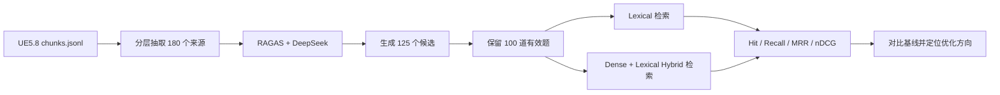

# UE5.8 RAG Benchmark 评测指南

本篇说明如何为 UE5.8 RAG 自动生成测试集，并分别评测 Lexical 与 Hybrid
检索质量。测试集生成成功只代表“题目准备完成”，必须继续运行检索评测，才能得到
Hit、Recall、MRR 和 nDCG 等质量结论。

## 1. 完整评测流程



相关文件：

| 文件 | 作用 |
|---|---|
| `config/testset.yaml` | RAGAS 生成规模、模型、采样与输出配置 |
| `scripts/generate_testset.py` | 自动生成问题、参考答案和标准证据 |
| `data/benchmark/ragas_sources.jsonl` | 分层抽取的来源文档 |
| `data/benchmark/ragas_testset.jsonl` | RAGAS 原生问题、答案与上下文 |
| `data/benchmark/ragas_cases.jsonl` | 转换后的检索 Benchmark 测试集 |
| `scripts/evaluate.py` | Lexical 或 Hybrid 自动评测 |
| `config/benchmark.yaml` | 报告路径与最低质量基线 |

## 2. 生成 100 道测试题

生成前确认：

- `data/chunks/engine/chunks.jsonl` 已完成。
- CUDA 和 `Qwen3-Embedding-0.6B` 可用。
- DeepSeek 账户有可用余额。
- API Key 只保存在当前 PowerShell 环境变量，不写入代码或配置文件。

```powershell
# 在克隆后的仓库根目录执行

$env:DEEPSEEK_API_KEY = "你的 DeepSeek API Key"

python .\scripts\generate_testset.py `
  --api-key-env DEEPSEEK_API_KEY `
  --base-url https://api.deepseek.com `
  --model deepseek-v4-flash
```

默认配置会：

1. 从 169 万条 chunk 中按来源、模块和符号类型分层采样 180 条。
2. 请求 RAGAS 生成 125 个候选题目。
3. 自动保留前 100 个带有可追踪 chunk ID 或 symbol 的有效样本。
4. 同时输出 RAGAS 原始格式和项目 Benchmark 格式。

最终成功标志：

```text
Prepared sources: 180
LLM preflight: OK (deepseek-v4-flash)
RAGAS candidate request: 125
Generated: 100
Benchmark cases: 100
```

只验证采样、不调用收费 API：

```powershell
python .\scripts\generate_testset.py --prepare-only
```

## 3. 生成阶段日志含义

| 阶段 | 含义 |
|---|---|
| `SummaryExtractor` | 为来源代码生成摘要 |
| `CustomNodeFilter` | 过滤不适合出题的内容 |
| `EmbeddingExtractor` | 使用本地 Qwen 生成语义向量 |
| `ThemesExtractor` | 提取网络、渲染、移动等主题 |
| `NERExtractor` | 提取类、函数、模块和 C++ 符号 |
| `CosineSimilarityBuilder` | 建立语义相似关系 |
| `OverlapScoreBuilder` | 建立实体重叠关系 |
| `Generating personas` | 生成不同开发者角色 |
| `Generating Scenarios` | 设计单跳和多跳问题场景 |
| `Generating Samples` | 生成最终问题、参考答案和证据 |

测试题通常分为：

- `single_hop_specific_query_synthesizer`：一个来源即可回答的具体问题。
- `multi_hop_specific_query_synthesizer`：需要组合多个具体来源。
- `multi_hop_abstract_query_synthesizer`：需要跨来源抽象、归纳或比较。

## 4. 抽查测试集质量

生成后先人工抽查问题、答案和引用上下文。自动生成数据不是天然正确的人工金标。

查看前 3 道检索测试题：

```powershell
Get-Content .\data\benchmark\ragas_cases.jsonl -First 3
```

查看前 2 道题的参考答案和上下文：

```powershell
Get-Content .\data\benchmark\ragas_testset.jsonl -First 2
```

建议检查：

- 问题是否符合真实 UE 开发场景。
- 参考答案是否完全来自 `reference_contexts`。
- `expected_chunk_ids` 和 `expected_symbols` 是否存在。
- 多跳题是否真的需要多个来源。
- 是否存在过长、语法异常或包含无关 persona 描述的问题。

## 5. 评测 Lexical

Lexical 测试衡量 SQLite FTS 与符号搜索能力，不使用 Embedding。

```powershell
python .\scripts\evaluate.py `
  --mode lexical `
  --input .\data\benchmark\ragas_cases.jsonl `
  --index .\data\index\lexical.sqlite3 `
  --output-json .\data\benchmark\lexical_benchmark_results.json `
  --output-markdown .\data\benchmark\lexical_benchmark_results.md
```

中文长句、自然语言改写和跨语言查询可能让 Lexical 得分很低。这不等于完整 RAG
不可用，而是说明该查询必须依赖 Dense 或 Hybrid。

## 6. 评测 Hybrid

先确认 Qdrant Server 正在运行，并且集合点数为 1,693,105。然后执行：

```powershell
python .\scripts\evaluate.py `
  --mode hybrid `
  --input .\data\benchmark\ragas_cases.jsonl `
  --index .\data\index\lexical.sqlite3 `
  --qdrant-config .\config\qdrant_server.yaml `
  --output-json .\data\benchmark\hybrid_benchmark_results.json `
  --output-markdown .\data\benchmark\hybrid_benchmark_results.md
```

Hybrid 会为每一道题生成查询向量，同时运行：

```text
Dense Qdrant 结果 ─┐
                   ├─ Reciprocal Rank Fusion ─ 最终 Top-K
Lexical SQLite 结果 ┘
```

第二次运行通常更快，因为查询向量保存在
`data/embeddings/cache.sqlite3`。

## 7. 指标含义

### Hit@K：有没有找到

只要前 K 条中存在至少一个正确结果，该题就记为命中。

```text
正确答案排名第 1：Hit@1、Hit@3、Hit@5、Hit@10 都为 1
正确答案排名第 4：Hit@1、Hit@3 为 0；Hit@5、Hit@10 为 1
前 10 条都没有：所有 Hit 指标都为 0
```

Hit@1 适合衡量用户是否能直接采用第一条结果；Hit@5/10 更适合衡量送给 LLM 的
候选上下文是否包含正确资料。

### Recall@K：应该找到的资料找全了多少

如果一道多跳题有 3 个标准 chunk，前 10 条找到其中 2 个：

```text
Recall@10 = 2 / 3 = 0.667
```

Hit@10 可能已经是 1，但 Recall@10 仍然不足，因为只找到部分证据。

### MRR：第一个正确结果排得多靠前

每道题按第一个正确结果排名计算倒数：

```text
第 1 名：1 / 1 = 1.0
第 2 名：1 / 2 = 0.5
第 5 名：1 / 5 = 0.2
未命中：0
```

MRR 是所有问题倒数排名的平均值，越接近 1 越好。

### nDCG：多个正确结果整体排得好不好

nDCG 同时考虑：

- 找到了多少正确资料。
- 正确资料是否排在前面。
- 多跳问题的多个证据是否排序合理。

范围为 0～1。Hit@10 很高但 nDCG 偏低，通常表示“能找到，但正确结果排得不够靠前”。

## 8. 当前 25 题初始基线

当前 Hybrid 初始结果：

| 指标 | 结果 |
|---|---:|
| Hit@1 | 0.5200 |
| Hit@3 | 0.8400 |
| Hit@5 | 0.9200 |
| Hit@10 | 1.0000 |
| Recall@5 | 0.7267 |
| Recall@10 | 0.8267 |
| MRR | 0.6983 |
| nDCG | 0.4783 |

解释：

- 候选召回较好，全部问题都能在前 10 找到至少一个正确答案。
- 第一条直接正确的比例只有 52%，排序仍需优化。
- 单跳问题表现最好。
- 多跳抽象问题的 Recall@10 较弱，说明跨文档证据没有找全。

100 题结果生成后，应以新的报告替换这组小样本基线。

## 9. 建议的阶段性目标

以下数值是本项目的工程目标，不是行业统一标准：

| 指标 | 内部试用 | 面向稳定使用 |
|---|---:|---:|
| Hit@1 | ≥ 0.60 | ≥ 0.75 |
| Hit@5 | ≥ 0.90 | ≥ 0.95 |
| Hit@10 | ≥ 0.97 | ≥ 0.99 |
| Recall@10 | ≥ 0.85 | ≥ 0.92 |
| MRR | ≥ 0.70 | ≥ 0.82 |
| nDCG | ≥ 0.55 | ≥ 0.70 |

不要只追求一个指标。用于给 LLM 提供上下文时，应优先保证 Recall@10；用于用户直接
查看搜索结果时，应优先提高 Hit@1、MRR 和 nDCG。

## 10. 根据结果选择优化方向

| 现象 | 常见原因 | 优先措施 |
|---|---|---|
| Hit@10 低 | Embedding、切块或过滤条件有问题 | 检查 chunk、Embedding 与 Qdrant |
| Hit@10 高，Hit@1 低 | 候选正确但排序不好 | 增加 Reranker |
| Recall@10 低 | 多证据找不全 | 提高候选数、查询拆解、多跳检索 |
| 中文问题 Lexical 为 0 | FTS 分词或长查询问题 | 使用 Hybrid、查询改写、符号抽取 |
| 单跳高、多跳低 | 缺少跨文档关系 | 父子 chunk、符号图谱、模块关系扩展 |
| nDCG 低 | 相关结果位置靠后或重复 | Reranker、去重和结果多样化 |

推荐优化顺序：

1. 增加 Reranker，提高 Hit@1、MRR 和 nDCG。
2. 在检索前抽取 C++ 类名、函数名和模块名。
3. 对中文长问题做查询改写并保留英文符号。
4. 将多跳问题拆成多个子查询，再合并候选。
5. 扩大人工标注集，避免只依赖同一个 LLM 生成和评判。

## 11. 配置质量门槛

在 `config/benchmark.yaml` 中设置最低指标：

```yaml
output_json: "data/benchmark/benchmark_results.json"
output_markdown: "data/benchmark/benchmark_results.md"
baseline:
  hit_at_5: 0.90
  recall_at_10: 0.85
  mrr: 0.70
  ndcg: 0.55
```

低于门槛时 `evaluate.py` 返回退出码 1，可用于 CI 阻止检索质量回退。

## 12. 常见问题

### DeepSeek 返回 401，Key 显示为 `****ocal`

说明远程 API 没有读取到真实环境变量。PowerShell 必须使用：

```powershell
$env:DEEPSEEK_API_KEY = "你的 Key"
```

并在同一个窗口执行生成命令。

### `rapidfuzz is required`

安装项目评测依赖：

```powershell
pip install -e ".[eval]"
```

### `LangchainLLMWrapper is deprecated`

这是 RAGAS 未来版本迁移提醒，不影响当前固定的 RAGAS 0.4.3。

### `Using sync embedding model in async context`

本地 Qwen Embedding 仍然可以正常工作，该提醒主要影响生成速度，不影响向量质量。

### 请求 125 道但最终少于 100 道

说明部分场景未能生成有效样本。增加 `documents` 或
`oversample_factor`，然后重新生成。不要直接复制重复题目补数。

## 13. 最终验收清单

- [ ] 测试集包含至少 100 道有效题。
- [ ] 单跳、多跳具体、多跳抽象均有覆盖。
- [ ] 人工抽查至少 20 道题和参考答案。
- [ ] Lexical 与 Hybrid 使用同一测试集分别评测。
- [ ] Hybrid 明显优于 Lexical。
- [ ] Hit@5、Recall@10、MRR 和 nDCG 达到项目基线。
- [ ] 按 category 检查薄弱问题类型。
- [ ] 每次调整切块、Embedding、融合或 Reranker 后重新评测。
- [ ] 保存报告和配置，确保结果可复现。
